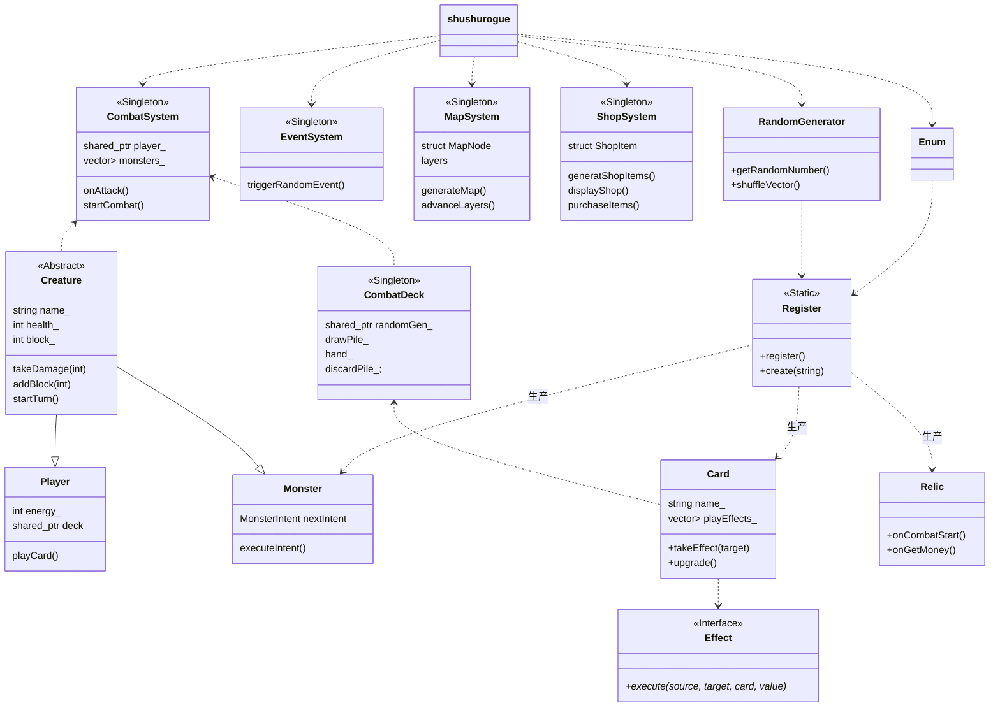

前向声明：不需要用到类的完整定义，如共享指针、引用、返回值、函数参数等

不允许使用不完整的类型 "const std::string" ：忘写string和iostream的头文件


## 单例模式：

```c++
class GameManager {
public:
    // 获取唯一实例
    static GameManager& getInstance() {
        static GameManager instance;  // C++11 保证线程安全
        return instance;
    }
    
    // 禁止拷贝和赋值
    GameManager(const GameManager&) = delete;
    GameManager& operator=(const GameManager&) = delete;
    
    void update() {
        std::cout << "Updating game..." << std::endl;
    }
    
private: 
    // 私有构造函数
    GameManager() {
        std::cout << "GameManager initialized" << std::endl;
    }
    
    // 析构函数
    ~GameManager() {
        std::cout << "GameManager destroyed" << std:: endl;
    }
};

// 使用
GameManager::getInstance().update();
```

### 便捷访问宏（可选）

```c++
// 定义宏简化访问
#define AUDIO_MGR AudioManager::getInstance()
#define RANDOM_MGR RandomManager::getInstance()

// 使用
AUDIO_MGR. playSound("hit.wav");
int roll = RANDOM_MGR.randomInt(1, 6);
```

### 提供测试接口

```c++
class RandomManager {
public:
    static RandomManager& getInstance() {
        static RandomManager instance;
        return instance;
    }
    
    // 用于单元测试
    void reset() {
        std::random_device rd;
        rng_.seed(rd());
    }
    
    void setSeed(unsigned int seed) {
        rng_.seed(seed);  // 可重现的测试
    }
    
private:
    std::mt19937 rng_;
};
```

**优点**：

- ✅ 线程安全（C++11 标准保证）
- ✅ 自动内存管理（程序结束时自动销毁）
- ✅ 懒加载（第一次调用时才创建）
- ✅ 代码简洁

## ⚖️ 单例模式的优缺点

### ✅ 优点

| 优点           | 说明                               |
| -------------- | ---------------------------------- |
| **全局访问**   | 任何地方都能访问，无需传递指针     |
| **唯一实例**   | 保证只有一个实例，节省资源         |
| **延迟初始化** | 第一次使用时才创建，按需加载       |
| **简化管理**   | 不需要担心多个实例导致的状态不一致 |

### ❌ 缺点

| 缺点         | 说明                       | 解决方案                      |
| ------------ | -------------------------- | ----------------------------- |
| **全局状态** | 增加耦合，难以追踪状态变化 | 减少单例数量，使用依赖注入    |
| **测试困难** | 单元测试时难以隔离         | 提供 `reset()` 方法或使用接口 |
| **线程安全** | 需要额外考虑多线程问题     | 使用 Meyers' Singleton        |
| **生命周期** | 销毁顺序不确定             | 避免单例之间互相依赖          |

单例模式适合：

- ✅ 需要全局访问的管理器类
- ✅ 资源唯一的系统（音频、输入、渲染）
- ✅ 跨系统的协调器（事件总线）

单例模式不适合：

- ❌ 业务逻辑类（Player, Enemy, Card）
- ❌ 可能需要多个实例的类
- ❌ 简单的数据容器


## 智能指针

```c++
class Game {
private:
    std::unique_ptr<Player> player;  // 游戏唯一玩家
    std::vector<std::shared_ptr<Enemy>> enemies;  // 多个系统可能共享敌人引用
    std::shared_ptr<AudioSystem> audio;  // 全局音频系统
    
public:
    void init() {
        player = std::make_unique<Player>();
        audio = std::make_shared<AudioSystem>();
        
        // 添加敌人
        for (int i = 0; i < 10; ++i) {
            enemies.push_back(std::make_shared<Enemy>());
        }
    }
};
```

搭配 `explicit` 防止隐式转换


using:定义类型别名，类似typedef


`std::function<返回类型(参数类型1, 参数类型2, ...)>` 是 C++11 引入的**函数包装器**，可以存储、复制、调用任何**可调用对象**

普通函数、lambda、函数对象


使用日志宏替代输出流，精简输出（按下不表，不确定终端实现方式之前不搞）

~~~md
在不使用 Cocos2d-x 的情况下，有以下几种日志输出方案：

## 方案1: 使用标准输出流（最简单）

````cpp
// filepath: d:\code\shushurogue\CombatDeck.cpp
#include <iostream>

// 替换所有 CCLOG 为 std::cout
std::cout << "[CombatDeck] Shuffling discard pile into draw pile" << std::endl;
std::cout << "[CombatDeck] Added " << card->getName() << " to hand (hand size: " << hand_.size() << ")" << std::endl;
````

## 方案2: 创建日志宏（推荐）

创建一个统一的日志系统：

````cpp
// filepath: d:\code\shushurogue\Logger.h
#pragma once
#include <iostream>
#include <sstream>
#include <ctime>

// 简单的日志宏
#define LOG_INFO(format, ...) Logger::log("INFO", format, ##__VA_ARGS__)
#define LOG_WARN(format, ...) Logger::log("WARN", format, ##__VA_ARGS__)
#define LOG_ERROR(format, ...) Logger::log("ERROR", format, ##__VA_ARGS__)

class Logger {
public:
    template<typename... Args>
    static void log(const char* level, const char* format, Args... args) {
        // 获取时间戳
        std::time_t now = std::time(nullptr);
        char timeStr[20];
        std::strftime(timeStr, sizeof(timeStr), "%Y-%m-%d %H:%M:%S", std::localtime(&now));
        
        // 输出日志
        std::cout << "[" << timeStr << "] [" << level << "] ";
        printf(format, args...);
        std::cout << std::endl;
    }
};
````

然后在代码中使用：

````cpp
// filepath: d:\code\shushurogue\CombatDeck.cpp
#include "Logger.h"

// ...existing code...

void CombatDeck::shuffle()
{
    LOG_INFO("[CombatDeck] Shuffling discard pile into draw pile");
    
    // ...existing code...
    
    LOG_INFO("[CombatDeck] Shuffle complete (draw pile: %zu, discard pile: %zu)",
        drawPile_.size(), discardPile_.size());
}
````

## 方案3: 使用 spdlog（专业日志库）

如果项目规模较大，推荐使用 spdlog：

````cpp
// filepath: d:\code\shushurogue\CombatDeck.cpp
#include "spdlog/spdlog.h"

void CombatDeck::shuffle()
{
    spdlog::info("[CombatDeck] Shuffling discard pile into draw pile");
    spdlog::info("[CombatDeck] Shuffle complete (draw pile: {}, discard pile: {})",
        drawPile_.size(), discardPile_.size());
}
````

## 方案4: 快速替换宏（最快实现）

在项目头文件中定义：

````cpp
// filepath: d:\code\shushurogue\Common.h
#pragma once
#include <iostream>
#include <cstdio>

// 替换 CCLOG
#define CCLOG(format, ...) printf(format "\n", ##__VA_ARGS__)
````

## 推荐的完整实现

````cpp
// filepath: d:\code\shushurogue\Logger.h
#pragma once
#include <iostream>
#include <fstream>
#include <string>
#include <ctime>
#include <iomanip>

class Logger {
public:
    enum Level {
        DEBUG,
        INFO,
        WARN,
        ERROR
    };

    static Logger& getInstance() {
        static Logger instance;
        return instance;
    }

    template<typename... Args>
    void log(Level level, const std::string& message) {
        std::cout << getTimestamp() << " [" << getLevelStr(level) << "] " << message << std::endl;
    }

private:
    Logger() = default;

    std::string getTimestamp() {
        auto now = std::time(nullptr);
        std::stringstream ss;
        ss << std::put_time(std::localtime(&now), "%Y-%m-%d %H:%M:%S");
        return ss.str();
    }

    const char* getLevelStr(Level level) {
        switch(level) {
            case DEBUG: return "DEBUG";
            case INFO: return "INFO";
            case WARN: return "WARN";
            case ERROR: return "ERROR";
            default: return "UNKNOWN";
        }
    }
};

// 便捷宏
#define LOG_DEBUG(msg) Logger::getInstance().log(Logger::DEBUG, msg)
#define LOG_INFO(msg) Logger::getInstance().log(Logger::INFO, msg)
#define LOG_WARN(msg) Logger::getInstance().log(Logger::WARN, msg)
#define LOG_ERROR(msg) Logger::getInstance().log(Logger::ERROR, msg)
````

使用示例：

````cpp
// filepath: d:\code\shushurogue\CombatDeck.cpp
#include "Logger.h"

void CombatDeck::shuffle()
{
    LOG_INFO("[CombatDeck] Shuffling discard pile into draw pile");
    
    // ...existing code...
    
    std::stringstream ss;
    ss << "[CombatDeck] Shuffle complete (draw pile: " << drawPile_.size() 
       << ", discard pile: " << discardPile_.size() << ")";
    LOG_INFO(ss.str());
}
````

**建议**：如果是快速迁移，使用**方案4**；如果要构建完整项目，使用**方案2或3**。
~~~

~~~md
可以创建一个简单的日志系统，将日志输出到文件。以下是实现方案：

## 方案1: 创建简单的日志类

````cpp
// filepath: d:\code\shushurogue\Logger.h
#pragma once
#include <fstream>
#include <string>
#include <ctime>
#include <iomanip>
#include <sstream>
#include <mutex>

class Logger {
public:
    static Logger& getInstance() {
        static Logger instance;
        return instance;
    }

    // 初始化日志文件
    bool init(const std::string& filename = "game.log") {
        std::lock_guard<std::mutex> lock(mutex_);
        logFile_.open(filename, std::ios::app); // 追加模式
        return logFile_.is_open();
    }

    // 写入日志
    void log(const std::string& level, const std::string& message) {
        std::lock_guard<std::mutex> lock(mutex_);
        if (logFile_.is_open()) {
            logFile_ << getTimestamp() << " [" << level << "] " << message << std::endl;
            logFile_.flush(); // 立即写入磁盘
        }
    }

    // 格式化日志（类似printf）
    template<typename... Args>
    void logf(const std::string& level, const char* format, Args... args) {
        char buffer[1024];
        snprintf(buffer, sizeof(buffer), format, args...);
        log(level, buffer);
    }

    ~Logger() {
        if (logFile_.is_open()) {
            logFile_.close();
        }
    }

private:
    Logger() = default;
    Logger(const Logger&) = delete;
    Logger& operator=(const Logger&) = delete;

    std::string getTimestamp() {
        auto now = std::time(nullptr);
        std::stringstream ss;
        ss << std::put_time(std::localtime(&now), "%Y-%m-%d %H:%M:%S");
        return ss.str();
    }

    std::ofstream logFile_;
    std::mutex mutex_; // 线程安全
};

// 便捷宏定义
#define LOG_INIT(filename) Logger::getInstance().init(filename)
#define LOG_INFO(msg) Logger::getInstance().log("INFO", msg)
#define LOG_WARN(msg) Logger::getInstance().log("WARN", msg)
#define LOG_ERROR(msg) Logger::getInstance().log("ERROR", msg)
#define CCLOG(format, ...) Logger::getInstance().logf("INFO", format, ##__VA_ARGS__)
````

## 方案2: 同时输出到文件和控制台

````cpp
// filepath: d:\code\shushurogue\Logger.h
#pragma once
#include <fstream>
#include <iostream>
#include <string>
#include <ctime>
#include <iomanip>
#include <sstream>
#include <mutex>

class Logger {
public:
    static Logger& getInstance() {
        static Logger instance;
        return instance;
    }

    bool init(const std::string& filename = "game.log", bool consoleOutput = true) {
        std::lock_guard<std::mutex> lock(mutex_);
        logFile_.open(filename, std::ios::app);
        enableConsole_ = consoleOutput;
        return logFile_.is_open();
    }

    void log(const std::string& level, const std::string& message) {
        std::lock_guard<std::mutex> lock(mutex_);
        std::string logLine = getTimestamp() + " [" + level + "] " + message;
        
        // 写入文件
        if (logFile_.is_open()) {
            logFile_ << logLine << std::endl;
            logFile_.flush();
        }
        
        // 输出到控制台（可选）
        if (enableConsole_) {
            std::cout << logLine << std::endl;
        }
    }

    template<typename... Args>
    void logf(const std::string& level, const char* format, Args... args) {
        char buffer[1024];
        snprintf(buffer, sizeof(buffer), format, args...);
        log(level, buffer);
    }

    ~Logger() {
        if (logFile_.is_open()) {
            logFile_.close();
        }
    }

private:
    Logger() : enableConsole_(true) {}
    Logger(const Logger&) = delete;
    Logger& operator=(const Logger&) = delete;

    std::string getTimestamp() {
        auto now = std::time(nullptr);
        std::stringstream ss;
        ss << std::put_time(std::localtime(&now), "%Y-%m-%d %H:%M:%S");
        return ss.str();
    }

    std::ofstream logFile_;
    std::mutex mutex_;
    bool enableConsole_;
};

#define LOG_INIT(filename) Logger::getInstance().init(filename, false) // false = 只输出到文件
#define LOG_INFO(msg) Logger::getInstance().log("INFO", msg)
#define LOG_WARN(msg) Logger::getInstance().log("WARN", msg)
#define LOG_ERROR(msg) Logger::getInstance().log("ERROR", msg)
#define CCLOG(format, ...) Logger::getInstance().logf("INFO", format, ##__VA_ARGS__)
````

## 使用示例

````cpp
// filepath: d:\code\shushurogue\CombatDeck.cpp
#include "CombatDeck.h"
#include "Logger.h" // 添加日志头文件
// ...existing code...

// 在程序入口处初始化日志系统
// 例如在 main.cpp 或游戏初始化时
int main() {
    // 初始化日志（只输出到文件）
    LOG_INIT("combat_deck.log");
    
    // 或者同时输出到文件和控制台
    // Logger::getInstance().init("combat_deck.log", true);
    
    // ...existing code...
}

// 在 CombatDeck.cpp 中使用
void CombatDeck::shuffle()
{
    CCLOG("[CombatDeck] Shuffling discard pile into draw pile");
    
    // ...existing code...
    
    CCLOG("[CombatDeck] Shuffle complete (draw pile: %zu, discard pile: %zu)",
        drawPile_.size(), discardPile_.size());
}
````

## 方案3: 按日期自动生成日志文件

````cpp
// filepath: d:\code\shushurogue\Logger.h
#pragma once
#include <fstream>
#include <string>
#include <ctime>
#include <iomanip>
#include <sstream>
#include <mutex>

class Logger {
public:
    static Logger& getInstance() {
        static Logger instance;
        return instance;
    }

    bool init(const std::string& baseFilename = "game") {
        std::lock_guard<std::mutex> lock(mutex_);
        std::string filename = generateFilename(baseFilename);
        logFile_.open(filename, std::ios::app);
        return logFile_.is_open();
    }

    void log(const std::string& level, const std::string& message) {
        std::lock_guard<std::mutex> lock(mutex_);
        if (logFile_.is_open()) {
            logFile_ << getTimestamp() << " [" << level << "] " << message << std::endl;
            logFile_.flush();
        }
    }

    template<typename... Args>
    void logf(const std::string& level, const char* format, Args... args) {
        char buffer[1024];
        snprintf(buffer, sizeof(buffer), format, args...);
        log(level, buffer);
    }

    ~Logger() {
        if (logFile_.is_open()) {
            logFile_.close();
        }
    }

private:
    Logger() = default;

    std::string generateFilename(const std::string& base) {
        auto now = std::time(nullptr);
        std::stringstream ss;
        ss << base << "_" << std::put_time(std::localtime(&now), "%Y%m%d") << ".log";
        return ss.str();
    }

    std::string getTimestamp() {
        auto now = std::time(nullptr);
        std::stringstream ss;
        ss << std::put_time(std::localtime(&now), "%Y-%m-%d %H:%M:%S");
        return ss.str();
    }

    std::ofstream logFile_;
    std::mutex mutex_;
};

#define LOG_INIT(basename) Logger::getInstance().init(basename)
#define LOG_INFO(msg) Logger::getInstance().log("INFO", msg)
#define LOG_WARN(msg) Logger::getInstance().log("WARN", msg)
#define LOG_ERROR(msg) Logger::getInstance().log("ERROR", msg)
#define CCLOG(format, ...) Logger::getInstance().logf("INFO", format, ##__VA_ARGS__)
````

## 日志文件示例输出

```
2025-12-16 14:30:15 [INFO] [CombatDeck] Initializing deck for player: Hero
2025-12-16 14:30:15 [INFO] [CombatDeck] Added Strike to draw pile
2025-12-16 14:30:15 [INFO] [CombatDeck] Shuffling discard pile into draw pile
2025-12-16 14:30:16 [INFO] [CombatDeck] Drew 5 cards (hand size: 5)
```

**推荐使用方案2**，这样可以在开发时看到控制台输出，发布时只输出到文件。
~~~

cd build

./shushurogue.exe

重新编译：cmake --build  .

```
# 删除整个 build 目录（Windows PowerShell）

Remove-Item -Recurse -Force build

# 重新创建目录并构建

mkdir build
cd build
cmake ..
cmake --build .
```


[捕获列表] (参数列表) mutable -> 返回类型 { 函数体 }
   ↑                ↑               ↑                  ↑              ↑
  这部分       这部分    可选      可选      实现
  决定能        决定     修饰符    指定     代码
  访问哪些      接受什么          返回值
  外部变量      参数               类型

- **`[](int* x)`**：告诉lambda："你**接受**一个指针作为参数"
- **`[int* x]()`**：告诉lambda："你**已经拥有**这个指针（从外部捕获）"


`shared_ptr<Player> player` 要作为参数传入，不然就用`Player::getInstance`


git statue

git add <file>

git commit -m "..."

git push origin main

